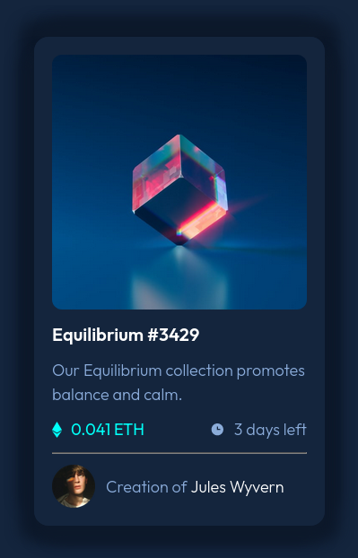

# Frontend Mentor - NFT preview card component solution

This is a solution to the [NFT preview card component challenge on Frontend Mentor](https://www.frontendmentor.io/challenges/nft-preview-card-component-SbdUL_w0U). Frontend Mentor challenges help you improve your coding skills by building realistic projects. 

## Table of contents

- [Overview](#overview)
  - [Screenshot](#screenshot)
  - [Links](#links)
- [My process](#my-process)
  - [Built with](#built-with)
  - [What I learned](#what-i-learned)
  - [Continued development](#continued-development)
- [Author](#author)
- [Acknowledgments](#acknowledgments)


## Overview

### Screenshot




### Links

- Solution URL: [Add solution URL here](https://your-solution-url.com)


## My process

### Built with

- Semantic HTML5 markup
- CSS custom properties
- Flexbox

### What I learned

```html

```
```css

```
```js

```

### Continued development

responsive web design, layout [focal point, white space and hierarchy] and advance javacript


## Author

- Website - [Tumelo](https://github.com/Tumelo4)
- Frontend Mentor - [@Tumelo4](https://www.frontendmentor.io/profile/Tumelo4)
- Twitter - [@tumelo108620031](https://www.twitter.com/tumelo108620031)


## Acknowledgments

Thanks to Frontend Mentor my skill will improve